# Cooperative Scheduler using Renode
Welcome to the CooperativeScheduler README!

## General Flow
### The Init() Function and Enqueueing Tasks:
This is the first function called in the main. Here, all the basic initialization (clock, UART, Systick, and interrupts) is done. Furthermore, the ready
and delayed priority queues are instantiated. After the initialization, tasks are enqueued into the ready queue before the processing begins in the application while loop. The queueTask() function takes the task function pointer as well as its priority as arguments, then proceeds to add them into the ready queue. It is important to note that high priorities are represented as lower integer values such that 0 is the maximum priority. The requirements specification document states that the scheduler should handle at least 8 priority levels, but our program is capable of handling any unsigned value for priority.

### The While Loop:
Next, the main application (infinite) loop starts. The loop constantly checks for the timerFlag (which is a flag raised every time a Systick interrupt occurs). Should the flag be found to be high, the Dispatch() function and the manageDelayedTasks() function within it  are called. While this is sufficient for the scheduler to operate correctly, we have added another if condition to check on whether the user has used the terminal to provide an input through the UART. This input can be used to manually prolong the currently executing task for the purpose of simulating longer execution times in runtime.

### The Dispatch() Function:
This function checks if the ready queue is empty. If it is empty, it simply outputs a message to the UART indicating that the ready queue is indeed empty. If it isn’t, however, it dequeues the highest priority task from the queue (using the dequeue task function implemented in the priority queue class) and executes it. In both cases, it sets the timerFlag to zero so as to not dispatch again until the Systick timer raises the flag once more (i.e. the timer has counted 1 tick or 100ms).

### The rerunMe() Function:
This function is called by a task if it is to be rerun and must be given the delay (or how many ticks it would wait before it is added to the ready queue) of the calling task. This function simply checks if the chosen delay is above zero. If so, it copies the task into a new queue item to be added to the delayed queue after some operations in the manageDelayedTasks() function; additionally, it raises the rerun flag which indicates that the most recently executed task needs to be rerun. If the delay is actually zero, it simply adds it to the ready queue immediately. The tasks are not allowed to call rerun me twice to prevent recursive growth of the number of tasks in the system. If called twice with a priority greater than 0, only the last rerunMe function call will have an effect. 

### The manageDelayedTasks():
This function manages the process of rerunning tasks and adding them to the delay queue. As we want to subtract the exact number of ticks that passed since the last time the remaining delay of each task was updated (which would need to be the same for all tasks during a pass on the queue), we first copy the number of ticks (which is incremented in the Systick interrupt) into another variable. Afterwards, we reset the value of the ticks to 0. We then call the tick function of the priority queue class which passes over the delayed queue and subtracts the copied number of ticks from the remaining delay of all the tasks; additionally, if a task’s remaining delay is found to be 0, it dequeues it and adds it to the ready queue. Finally, the function checks if the rerun flag is high. If so, it enqueues the delayed task (which would’ve been copied into a new queue item in the rerunMe() function as mentioned before) using the queueDelayedTask function and simply resets the rerun flag.

This process then repeats once more from the check on the timer flag.

***

## Unit Tests
### Ready Queue (Priority Queue): 

As previously mentioned, the higher priority tasks have the lowest numerical priority number (priority 0 is the highest). For this unit test, it was important to test the sorting functionality of the queue (ensure the highest priority tasks are dequeued first). As such, four dummy tasks were 
inserted into the queue as shown below, in random order of priority. The while loop afterwards will empty out the queue and execute each task, then go back to the default process of sending “Renode Alive !!” to the UART. The tasks simply send a short message through the uart interface to identity themselves. The outputs are in ascending priority order as expected:

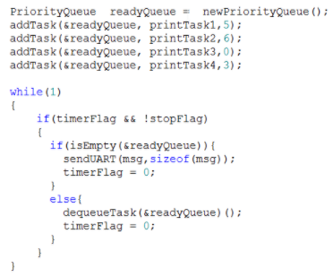
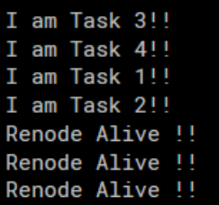

### Delayed Queue (Priority Queue): 

The priority queue dedicated for delayed tasks works similarly for the ready queue, except for the fact that it takes two numerical values when adding to the queue: the delay in ticks, and the priority of the task for when it gets re-added into the Ready queue. These two numbers are the last two parameters in the addDelayedTask() function respectively. Two of the tests taken are shown below, where the delay of all the tasks is varied between 10 and 2.
For the first test, where each task is readded to the ready queue after 10 ticks, we see that each task does indeed run after 10 iterations of the test while loop. For the second test, where each task is readded into the queue after 2 ticks, we notice that the two tasks with the highest priorities are dominating the cpu, since they will always be executed first after being re-added to the ready queue.

### Test 1:
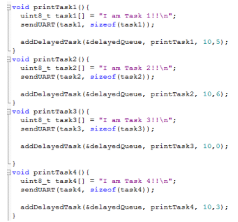
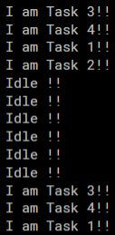
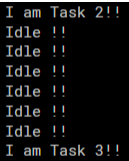 

### Test 2:
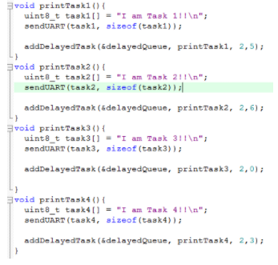
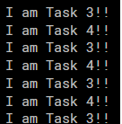

***

## Demo Tests
### Demo 1:
For the first demo test, we have the following task configuration:

||   Priority    | Delay (delay queue) |
| :---: | :---: | :---: |
| `Task 1`  | 1| 4|
| `Task 2`  | 2| 2|
| `Task 3`  | 3| 2|

If we trace this for the first couple of cycles, we will get the following:
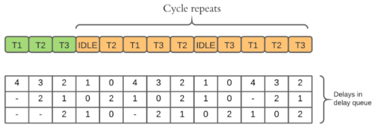

This output is the same as the program output, which can be seen below: 
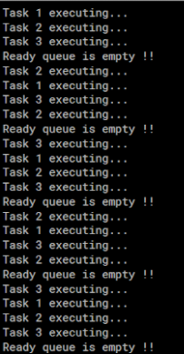
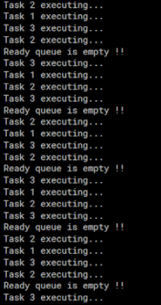

### Demo 2:
For the second demo test, we have the following task configuration:

||  Priority    | Delay (delay queue) | Execution Time (ms) |
| :---: | :---: | :---: | :---: |
| `Task 1`  | 1| 4| 100 |
| `Task 2`  | 2| 2| 400 |
| `Task 3`  | 3| 2| 100 |

If we trace this for the first couple of cycles, we will get the following:
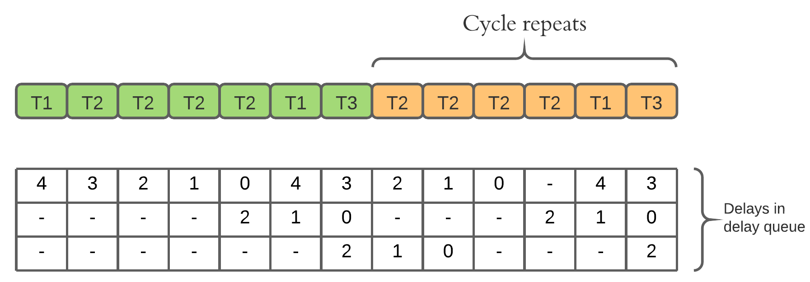

This output is the same as the program output, which can be seen below. It should be noted that each task execution message is followed by an integer value inidcating 
the number of ticks that have passed since the task's execution started. 
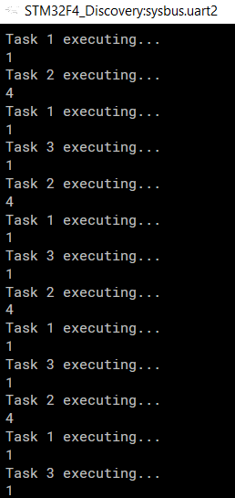

***

## Running and Building the Code
You should follow these steps:

1. After downloading the project file, run the µVision5 Project titled CooperativeScheduler.
2. If you would like to change the priorities of the tasks and their delay queue sleeping times, go to these parts in the code and change them accordingly: 
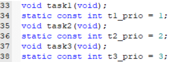
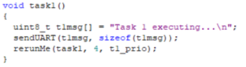
3. You may use the queueTask() function to add tasks to the queue along with their priorities after the Init() function call. 
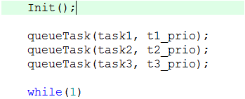
4. Build the project and make sure there are no errors.
5. In order to simulate using Renode, you first need to go to <Renode_Installation_Path>\scripts\single-node and open the file named stm32f4_discovery.resc using any text editor. 
6. Change the value of $bin to the path of the application binary as shown below (the path of the application binary is <Keil_Project_Path>\Objects\<Keil_Project_Name>.axf)
7. Make sure showAnalyzer command uses sysbus.uart2
8. Open Renode.exe
9. Type the command s @scripts/single-node/stm32f4_discovery.resc in the Renode shell to run the script.
10. The script will run and the output will be displayed in the UART analyzer window.
11. If you want to cancel a test and run another, type the command Clear in the Renode shell. This will stop the program execution. The script can then be run once again through step 7.

